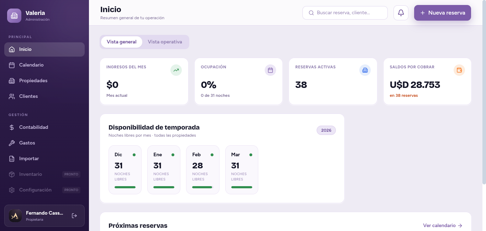
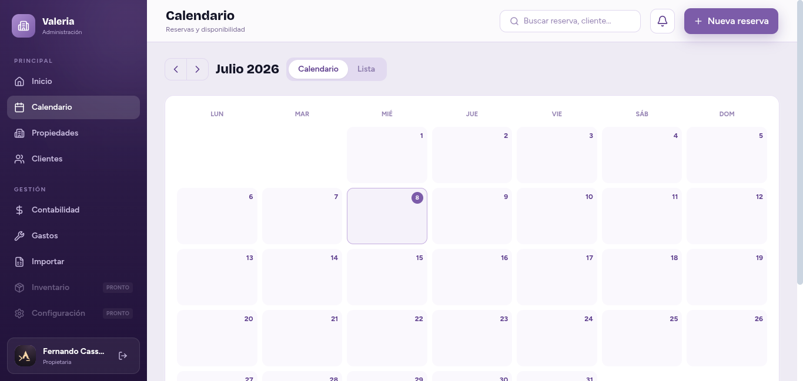
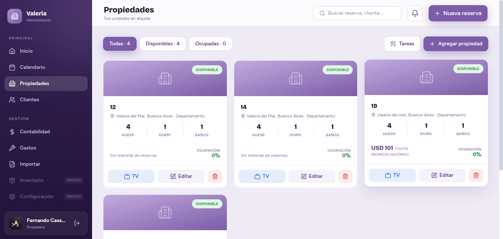
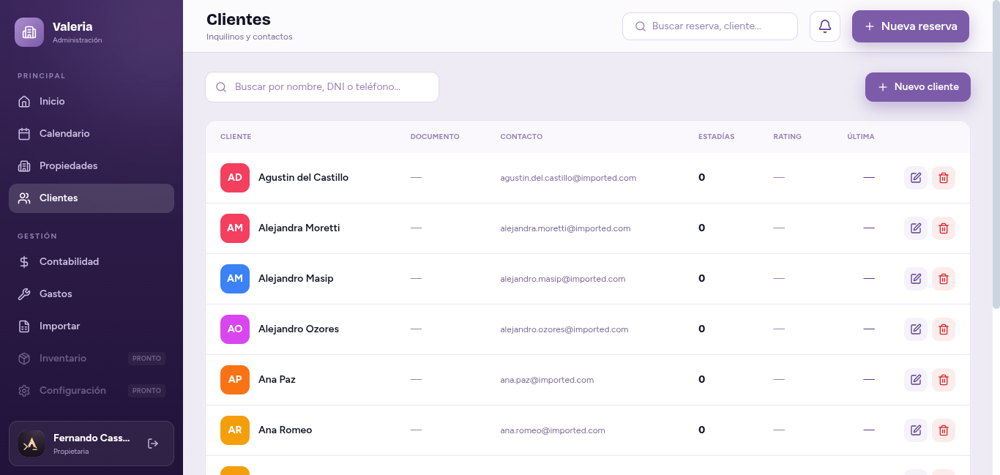
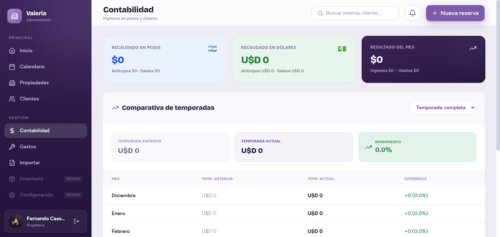
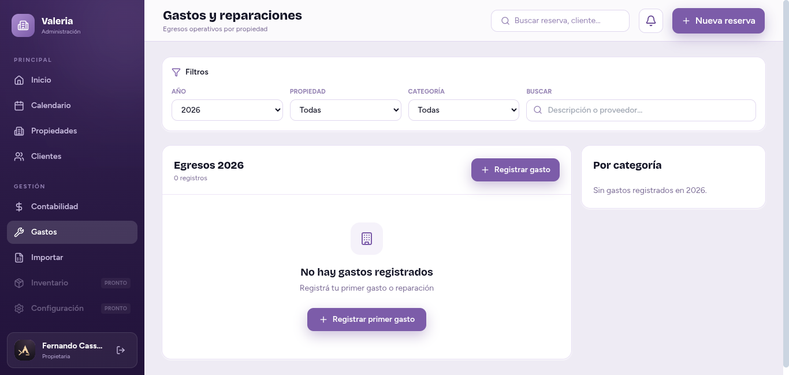
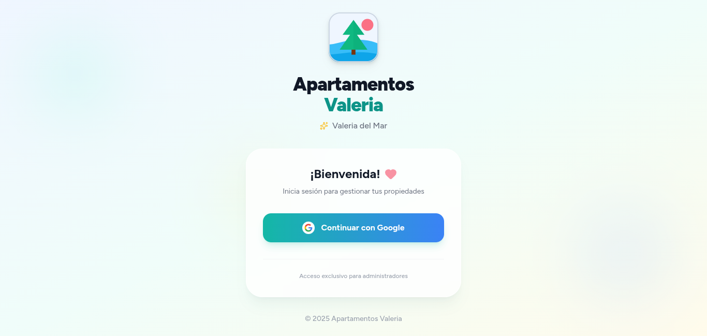

# Apartamentos Valeria

Sistema web para administrar propiedades de alquiler temporal: reservas, clientes, pagos, gastos, check-in/check-out, autenticación con Google y carga de comprobantes. El repositorio está preparado para desarrollo local con frontend React, backend FastAPI y despliegue con Docker Compose.

## Vista previa

| Inicio | Calendario |
|---|---|
|  |  |

| Propiedades | Clientes |
|---|---|
|  |  |

| Contabilidad | Gastos y reparaciones |
|---|---|
|  |  |

<details>
<summary>Pantalla de login</summary>



</details>

### Flujos en video

| Nueva reserva | Nueva propiedad |
|---|---|
| <video src="docs/nueva-reserva.mp4" controls width="320"></video> | <video src="docs/nueva-propiedad.mp4" controls width="320"></video> |

> Si los videos no se reproducen inline en tu visor de Markdown, abrilos directamente: [`docs/nueva-reserva.mp4`](docs/nueva-reserva.mp4) · [`docs/nueva-propiedad.mp4`](docs/nueva-propiedad.mp4)

## Camino rápido

1. Copiá el archivo de entorno del backend y completá tus valores locales:
   ```bash
   cp backend/env.example backend/.env
   ```
2. Levantá el backend:
   ```bash
   cd backend
   python -m venv venv
   source venv/bin/activate
   pip install -r requirements.txt
   uvicorn main:app --reload --host 127.0.0.1 --port 8000
   ```
3. Levantá el frontend en otra terminal:
   ```bash
   cd frontend
   npm install
   npm run dev
   ```
4. Abrí la app en `http://localhost:5173` y la documentación de la API en `http://localhost:8000/docs`.

## Qué hay en el repositorio

| Área | Tecnología | Ruta | Uso |
|---|---|---|---|
| Frontend | React + Vite + TypeScript + Tailwind CSS | `frontend/` | Interfaz de administración |
| Backend | FastAPI + SQLAlchemy async | `backend/` | API, autenticación y lógica de negocio |
| Base de datos | PostgreSQL | `database/` | Esquema, migraciones SQL y datos iniciales |
| Infraestructura | Docker Compose + Traefik | `docker-compose.yml` | Despliegue con imágenes Docker y secretos externos |

## Requisitos

- Node.js 18 o superior.
- Python 3.11 o superior.
- PostgreSQL 15 o superior para desarrollo local.
- Docker Engine y Docker Compose para despliegue containerizado.
- Credenciales propias para Google OAuth, OpenRouter y MinIO/S3 si vas a usar esas integraciones.

## Configuración de entorno

El backend usa variables de entorno. Tomá `backend/env.example` como plantilla:

```bash
cp backend/env.example backend/.env
```

Checklist mínimo antes de correr la app:

- [ ] `SECRET_KEY` y `SESSION_SECRET_KEY` generadas con valores aleatorios.
- [ ] `POSTGRES_HOST`, `POSTGRES_USER`, `POSTGRES_PASSWORD` y `POSTGRES_DB` apuntando a tu base local.
- [ ] `GOOGLE_CLIENT_ID` y `GOOGLE_CLIENT_SECRET` configurados si vas a probar login con Google.
- [ ] `MINIO_*` configurado si vas a subir comprobantes o documentos.
- [ ] `OPENROUTER_API_KEY` configurada solo si vas a usar funciones de IA.
- [ ] `CORS_ORIGINS` incluye la URL local del frontend, por ejemplo `http://localhost:5173`.

> No subas archivos `.env`, secretos reales, dumps o credenciales a Git. El archivo versionado debe ser solo `backend/env.example` con placeholders.

## Desarrollo local

### Backend

```bash
cd backend
python -m venv venv
source venv/bin/activate
pip install -r requirements.txt
uvicorn main:app --reload --host 127.0.0.1 --port 8000
```

URLs útiles:

- API: `http://localhost:8000`
- Swagger: `http://localhost:8000/docs`
- Health check: `http://localhost:8000/health`

### Frontend

```bash
cd frontend
npm install
npm run dev
```

La app queda disponible en `http://localhost:5173`.

### Base de datos

Creá una base PostgreSQL y aplicá los scripts necesarios desde `database/` según tu flujo de trabajo:

```bash
psql -U postgres -d apartamentos_valeria -f database/schema.sql
psql -U postgres -d apartamentos_valeria -f database/seed.sql
```

Si usás otro usuario, host o nombre de base, actualizá `backend/.env`.

## Docker Compose

El `docker-compose.yml` está orientado a despliegue con imágenes publicadas en GitHub Container Registry (GHCR), red externa de Traefik y secret externo para el backend.

| Recurso | Valor esperado |
|---|---|
| Red pública | `network_public` creada previamente |
| Secret backend | `apartamentos_backend_env` creado fuera del repositorio |
| Backend | `ghcr.io/fer336/apartamentos-backend:${BACKEND_IMAGE_TAG:-latest}` |
| Frontend | `ghcr.io/fer336/apartamentos-frontend:${FRONTEND_IMAGE_TAG:-latest}` |

### Despliegue automático (CI/CD)

Cada tag `vX.Y.Z` pusheado a `main` dispara `.github/workflows/deploy.yml`: valida el formato del tag, construye y publica ambas imágenes en GHCR, crea el GitHub Release correspondiente y notifica al webhook de Portainer para redesplegar el stack.

```bash
git tag -a v1.0.0 -m "Descripción del release"
git push origin v1.0.0
```

Un push normal a `main` (sin tag) no dispara ningún despliegue.

Ejemplo de despliegue, ajustando los valores a tu entorno:

```bash
docker network create network_public
docker secret create apartamentos_backend_env backend/.env
docker compose up -d
```

En Swarm o Portainer, creá el secret desde el panel/CLI y no lo guardes en archivos versionados.

## Seguridad antes de publicar

Antes de subir este repositorio a GitHub, verificá:

- [ ] `backend/.env` no está trackeado.
- [ ] No existen claves reales de Google, OpenRouter, PostgreSQL, MinIO/S3 o tokens en archivos versionados.
- [ ] `node_modules/`, `__pycache__/`, `.atl/`, dumps y archivos temporales quedan ignorados.
- [ ] La documentación pública usa placeholders, no credenciales reales.
- [ ] Si alguna credencial real fue expuesta alguna vez, rotala antes de publicar.

Comandos útiles:

```bash
git status --short
git grep -nE 'password|secret|token|api[_-]?key|client[_-]?secret|postgres://|sk-' -- . ':!backend/env.example'
```

## Notas de mantenimiento

- Código, comentarios y commits se mantienen en inglés.
- Documentación de producto y textos visibles para usuarios se mantienen en español.
- Las credenciales viven en archivos locales ignorados o en secrets del entorno de despliegue.
